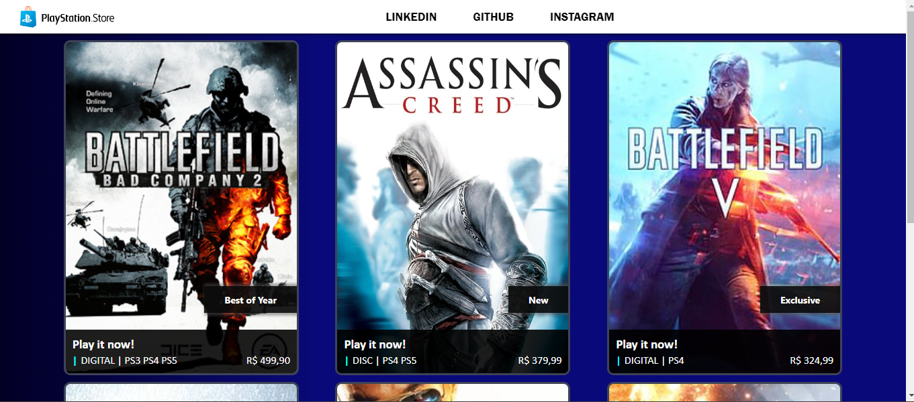

<h1 align="center">
 
   
  Recriando a Playstation Store
</h1>

  <!-- project badges -->
  

    
   	
  
 

  	

  <!-- project description and menu -->
  

      Preview da recriação
     
     
     
    <a 
      href="https://github.com/BrunoPequeno/Playstation-store/issues">
      Report Bug
    </a>
    ·
    <a 
      href="https://github.com/BrunoPequeno/Playstation-store/issues/new">
      Request Feature
    </a>
		<h2> Clique aqui e acesse a Aplicação </h2>
		<a href="https://pequeno-playstation-store.vercel.app/" target="_blank"> Recriação da Playstation Store </a> 
  

## Tecnologia e técnicas
- [x] Esse projeto foi desenvolvido utilizando a tecnologia Angular e todos os seus benefícios disponibilizados para o bom desenvolvimento de um programador. Utilizamos fragmentação de componentes (micro e macro), bem como estruturação e padronização de projeto, trazendo mais conforto para futuras manutenções ou alterações.
## Feedback
- Foi muito legal desenvolver um projeto já com uma complexidade bem mais ampla do que estavamos acostumados, mas ao longo das diversas aulas fomos aprendendo e aprofundando um pouco mais em cada conceito gradativamente, o que eliminou aquele primeiro impacto e diminuiu a dificuldade no desenvolvimento. Agradeço mais uma vez a [DIO](www.dio.me) e ao [Santander](https://app.becas-santander.com/pt-BR/program/bolsas-santander-santander-bootcamp-2023) pela oportunidade! 
